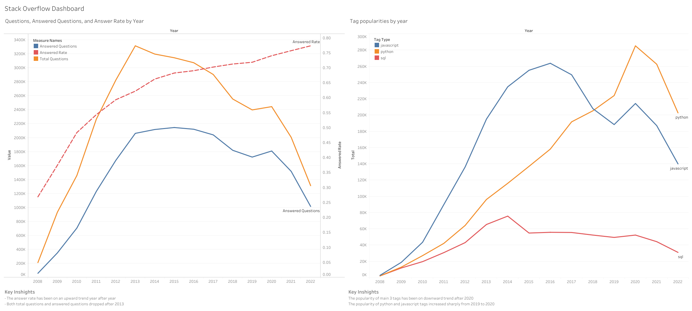

# Stack Overflow Analysis

## Project Overview
This project analyzes Stack Overflow data to figure out technical trends and community health using Stack Overflow's puclic data.

---

## Analysis Points
- **Total questions Trend**: Capture technology popularity over time
- **Time to First Answer(TTA)**: Median time from question creation to the **first** answer\
- **Insights**: actionable takeaways for community operations

---

## Data source  
Big Query Public data - [stackoverflow](bigquery-public-data.stackoverflow)
- post_questions - [post_questions](bigquery-public-data.stackoverflow.posts_questions)
- post-answers - [post_answers](bigquery-public-data.stackoverflow.posts_answers)

---

##  Tools Used
- **Google BigQuery**: Data cleaning, transformation, and analysis using SQL
- **Tableau**: Data visualization and dashboard creation
- **GitHub**: Version control and portfolio hosting

---

## Cleaning Rules
- **`creation_date` IS NOT NULl**: Excluded missing answer data
- **`first_answer` >= `question_creation_date`**: Removed invalid data

---

## Methods (Reproducibility)
- TTA = `MIN(answer.creation_date) - question.creation_date` per question
- Median via `APPROX_QUANTILES` in BigQuery
- Period analyzed: 2019-01 to 2020-12

---

## Key Insights
-  **Python**: The number of questions concerning python is increasing.
-  **Median(Minute) = 34**: On average, it takes about **34 minutes** for the first answer.
-  **75percentile = 5 hours**: 75% of questions receive their first answer within **5 hours**.
-  The answer rate has shown an upward trend year by year.
-  The popularity of the top three tags has shown a downward trend, possibly due to **the emergence of new technologies** in recent years.

---

## Next Steps
- **New Technologies**: Analyze latest data and identify emerging technologies.
- **Regular Health level check**: Maintain the community’s overall health by monitoring the answer rate regularly.

--- 

##  Dashboard
- Sample Visual(Trend lines by year)


- Tableau Public
  [View Interactive Dashboard on Tableau Public](https://public.tableau.com/views/StackOverflow_17575488423400/Dashboard1?:language=en-US&:sid=&:redirect=auth&:display_count=n&:origin=viz_share_link)

--- 

##  Repository Structure
```
stack_overflow_analysis/
├── sql/
│   ├── 01_question_trend.sql[01_question_trend.sql]()
│   ├── 02_tag_trend.sql[02_tag_trend.sql]()
│   └── 03_tta.sql[](03_tta.sql)
├── results/
│   ├── report.md[report.md]()
│   └── img/
│       ├── stack_overflow_dashboard.png[stack_overflow_dashboard.png]()
│       ├── trend-plot.png[trend-plot.png]()
│       └── tag_popularity.png[tag_popularity.png]()
└── README.md
```
---

##  Contact
Created by Asuka Osuki – [LinkedIn](www.linkedin.com/in/asuka-osuki-24958b32b) 
